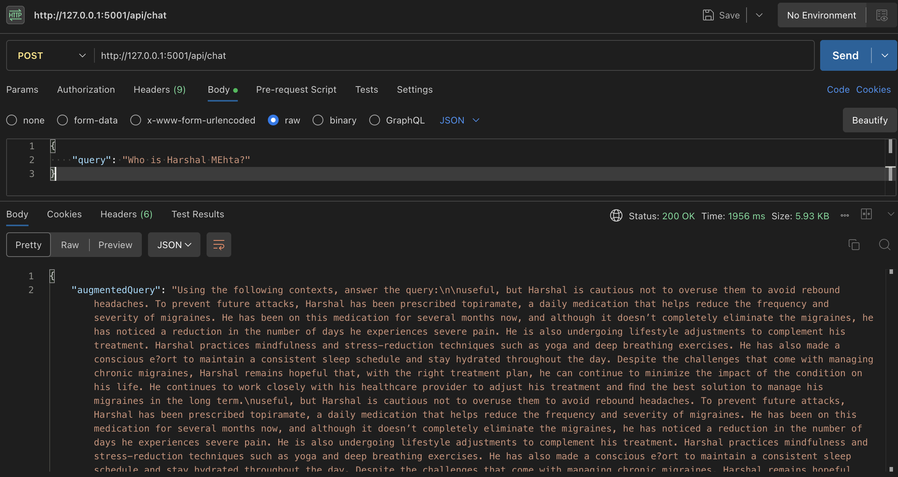

# RAG-Based Chatbot with Pinecone and OpenAI

This project implements a RAG (Retrieval-Augmented Generation) chatbot using **Flask**, **Pinecone**, and **OpenAI's API**. It extracts text from PDFs, stores embeddings in Pinecone, and retrieves relevant information to enhance chatbot responses.

## 🚀 Features
- Extracts text from PDFs and converts them into embeddings.
- Stores embeddings in Pinecone for fast retrieval.
- Augments chatbot responses with retrieved knowledge.
- Monitors the `uploads/` directory for new PDFs automatically.

---

## 🛠️ Installation

### 1️⃣ Clone the Repository
git clone https://github.com/MargiShah18/medical_chat.git

### 2️⃣ Navigate to the Backend Directory
cd medical_chat/backend

### 3️⃣ Create a Virtual Environment (Recommended)
python -m venv venv
source venv/bin/activate  # macOS/Linux
venv\Scripts\activate     # Windows

### 4️⃣ Install Dependencies
pip install -r requirements.txt

### 5️⃣ Set Up Environment Variables
OPENAI_API_KEY2=your-openai-api-key
PINECONE_API_KEY2=your-pinecone-api-key
(If you need our API keys, please contact us via email.)

### ▶️ Running the Backend
run the command:-
python main.py
✅ The server will start, and it will automatically process PDFs added to the uploads/ folder.

### How to Use the Chatbot
Add a PDF to the uploads/ folder.
Start the backend and frontend.
Ask questions in Postman or the frontend interface.
{
    "query": "Who is Harshal Mehta?"
}

### for running frontend
cd frontend
npm install
npm run dev

### 🛠️ Testing in Postman
Method: POST

Endpoint: http://127.0.0.1:5001/api/chat

Headers: Content-Type: application/json

Body (JSON, raw format):
{
    "query": "Who is Harshal MEhta?"
}

just like attached photo for reference

